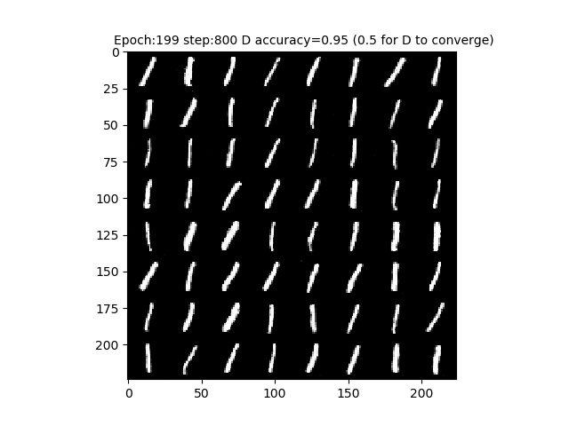
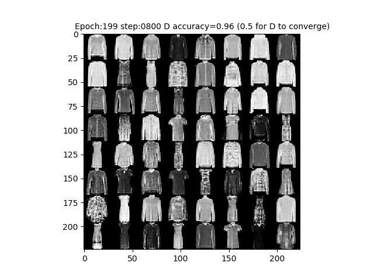

### Basic Generating adversarial networks
Pytorch Implementation of Generating adversarial networks on MNIST and Fashion MNIST.  
#### An generated example on MNIST:  
  

#### An generated example on Fashion MNIST:

